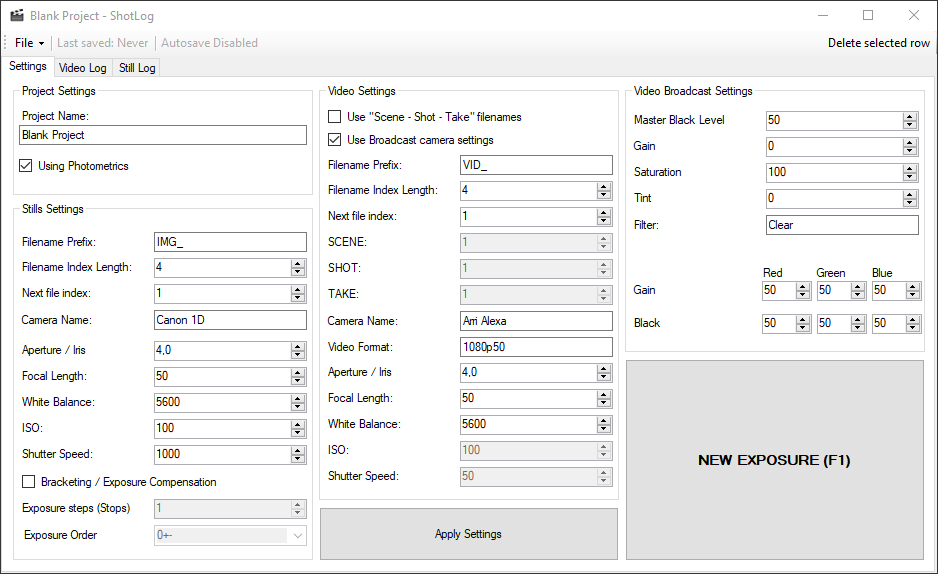
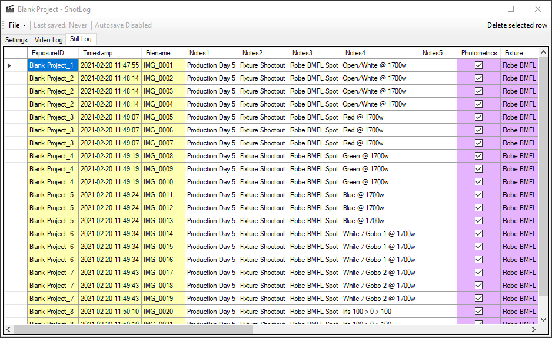
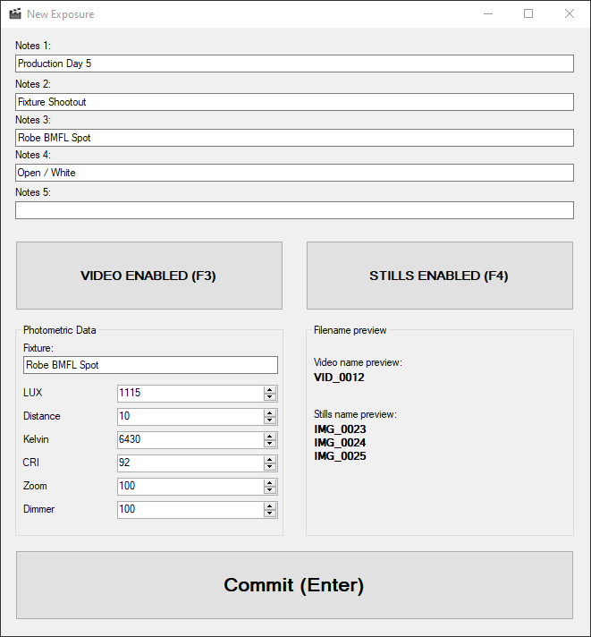

# ShotLog
**What is ShotLog?**
This application is made for anyone who want a dedicated app for logging video clips and still image files during a photo-shoot, videoproduction or a fixture shootout.
The app keeps track of filenames, takes, notes, camera settings and so on.
With global exposure IDs ShotLog helps you keep still images and videoclips linked.

**Lighting fixture shootouts**
ShotLog is tailor made for fixture shootouts. Features include Photometric data logging for LUX, CRI, Kelvin, Dimmer and Zoom-values, and support for bracketed still photography.

## Screenshots
**Main window** 

**Still image log** 

**New Exposure Window** 

